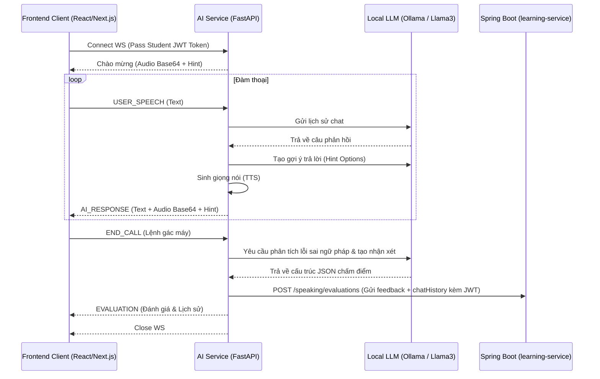

# 🧠 St3pLearn - AI Service (FastAPI)

> **Dịch vụ AI phân tích và xử lý ngôn ngữ tự nhiên hỗ trợ đàm thoại, gợi ý phản hồi, và tự động chấm điểm ngữ pháp tiếng Anh trong hệ thống St3pLearn (FastAPI + Ollama + EdgeTTS)**

---

## 📖 Giới thiệu (Overview)

**St3pLearn AI Service** là một dịch vụ độc lập viết bằng **FastAPI (Python)**, đóng vai trò đầu não AI xử lý các tương tác thông minh cho ứng dụng St3pLearn:
1. **AI Speaking Practice Room (Hội thoại thời gian thực):** Kết nối WebSocket song song để trò chuyện với trợ lý ảo bằng giọng nói tiếng Anh.
2. **AI Response Hint Generation (Gợi ý phản xạ):** Phân tích ngữ cảnh câu nói của AI để đề xuất 2 phương án đối đáp tự nhiên, ngắn gọn bằng tiếng Anh cho học sinh khi gặp khó khăn về ý tưởng.
3. **AI Grammar Correction & Feedback (Nhận xét sửa lỗi):** Khi cuộc gọi kết thúc, dịch vụ sẽ gọi mô hình LLM để đánh giá tổng quan ngữ điệu và trích xuất danh sách các câu sai ngữ pháp kèm giải thích tiếng Việt chi tiết.
4. **Text-to-Speech (Edge TTS):** Chuyển đổi phản hồi văn bản của AI sang file âm thanh chất lượng cao để truyền trực tiếp dạng base64 về trình duyệt của học viên.

---

## 🏗 Kiến trúc Tương tác WebSocket (`/api/ai/speaking/ws`)



---

## 🛠 Công nghệ & Thư viện (Tech Stack)

* **Framework:** FastAPI (Python 3.10+), Uvicorn
* **HTTP Client:** HTTPX (Xử lý các request bất đồng bộ tới Ollama và Spring Boot Gateway)
* **Text-to-Speech:** `edge-tts` (Sinh giọng nói tự nhiên từ Microsoft Edge TTS API)
* **LLM Engine:** [Ollama](https://ollama.com/) (Chạy local mô hình Llama 3 / Qwen)
* **JSON parser & validation:** Pydantic

---

## 📁 Cấu trúc Thư mục & Vai trò từng File (Directory Structure & File Roles)

```text
ai-service/
├── app/
│   ├── api/
│   │   ├── routes.py                 # Định nghĩa các REST API Endpoints chính (nhận tài liệu khóa học, chat RAG, sinh Quiz, Flashcard).
│   │   └── speaking_websocket.py      # Endpoint WebSocket (/ws) duy trì kết nối phòng luyện nói phản xạ, xử lý STT, tạo gợi ý, Edge TTS và gửi nhận xét sửa lỗi về Spring Boot.
│   ├── core/
│   │   └── config.py                 # Nạp và quản lý các cấu hình hệ thống, biến môi trường (.env) như URL của Ollama, tên mô hình LLM, URL Spring Boot.
│   ├── db/
│   │   └── vector_store.py           # Kết nối cơ sở dữ liệu vector ChromaDB; lưu trữ, xóa và truy vấn các đoạn văn bản (chunks) tương đồng nhất.
│   ├── models/
│   │   └── schemas.py                # Định nghĩa các mô hình Pydantic để kiểm duyệt cấu trúc dữ liệu đầu vào và đầu ra cho các API.
│   ├── services/
│   │   ├── document_service.py       # Trích xuất chữ thô từ tệp (.pdf, .docx, .txt), cắt nhỏ văn bản (sliding window) và xử lý nạp tài liệu không đồng bộ ngầm.
│   │   ├── edge_tts_service.py       # Tích hợp thư viện edge-tts chuyển văn bản tiếng Anh của AI thành luồng âm thanh Base64.
│   │   ├── llm_service.py            # Dịch vụ phụ trợ tương tác trực tiếp với Ollama (gọi API sinh văn bản, chat...).
│   │   ├── quiz_generator_service.py # Biên soạn đề thi thông qua gọi Ollama JSON Mode, có cơ chế tự động thử lại (Retry) tối đa 3 lần khi lỗi cú pháp.
│   │   └── rag_service.py            # Nhận câu hỏi, truy xuất ngữ cảnh liên quan từ ChromaDB, ghép vào system prompt nghiêm ngặt và gọi stream chat từ Ollama.
│   └── main.py                       # Điểm khởi chạy FastAPI, cấu hình CORS (cho phép Next.js gọi API) và đăng ký các routes chính.
├── data/
│   └── chroma_db/                    # Thư mục lưu trữ dữ liệu vector ChromaDB cục bộ dưới dạng file trên ổ cứng.
├── requirements.txt                  # Danh sách các thư viện Python cần cài đặt.
└── .env                              # Lưu trữ các biến môi trường cấu hình cổng chạy, URL dịch vụ.
```

---

## ⚡ Hướng dẫn Cài đặt & Khởi chạy (Setup & Running)

### 1. Cài đặt Python Virtual Environment
Di chuyển vào thư mục `BE/st3p-learn/ai-service`:
```bash
cd BE/st3p-learn/ai-service
python -m venv venv
```

Kích hoạt môi trường ảo:
* **Windows (PowerShell):**
  ```powershell
  .\venv\Scripts\Activate.ps1
  ```
* **macOS / Linux:**
  ```bash
  source venv/bin/activate
  ```

### 2. Cài đặt các thư viện phụ thuộc
```bash
pip install -r requirements.txt
# Cài thêm edge-tts phục vụ sinh giọng nói
pip install edge-tts
```

### 3. Cấu hình biến môi trường (`.env`)
Tạo file `.env` tại thư mục gốc `ai-service`:
```env
OLLAMA_BASE_URL=http://localhost:11434
OLLAMA_MODEL=llama3
```

### 4. Thiết lập và Khởi chạy Ollama
1. Tải và cài đặt Ollama từ [Ollama Official Site](https://ollama.com/).
2. Tải mô hình sử dụng (Ví dụ Llama 3):
   ```bash
   ollama pull llama3
   ```
3. Đảm bảo Ollama Server đang chạy tại cổng `11434`.

### 5. Khởi động AI Service
```bash
uvicorn app.main:app --host 127.0.0.1 --port 7777 --reload
```
Dịch vụ sẽ khả dụng tại địa chỉ `http://localhost:7777`.

---

## 🔌 API & WebSocket Documentation

### 1. WebSocket Endpoint: `/api/ai/speaking/ws`
Kết nối thời gian thực cho phòng đàm thoại.

* **Query Parameters:**
  - `studentId` (string): ID của học viên.
  - `courseId` (string): ID khóa học.
  - `lessonId` (string): ID bài học.
  - `topicContent` (string): Chủ đề hoặc tài liệu luyện tập do người dùng nhập hoặc nạp từ file.
  - `token` (string): JWT Access Token của học sinh dùng để xác thực khi lưu kết quả vào Spring Boot.

* **Định dạng Tin nhắn gửi từ Client (JSON):**
  - **Gửi câu nói:** `{"type": "USER_SPEECH", "text": "My answer is..."}`
  - **Gác máy:** `{"type": "END_CALL"}`

* **Định dạng Tin nhắn trả về từ Server (JSON):**
  - **Phản hồi của AI:**
    ```json
    {
      "type": "AI_RESPONSE",
      "text": "That's awesome! How long have you been doing that?",
      "audio": "base64_audio_string...",
      "hint": "Option 1: 'For two years.' | Option 2: 'Just recently.'"
    }
    ```
  - **Đánh giá & sửa lỗi cuối buổi:**
    ```json
    {
      "type": "EVALUATION",
      "evaluation": {
        "feedback": "Bạn nói rất tự nhiên, tuy nhiên cần lưu ý...",
        "corrections": [
          {
            "original": "I goes to school yesterday",
            "corrected": "I went to school yesterday",
            "explanation": "Yesterday diễn tả quá khứ nên 'go' chuyển thành 'went'."
          }
        ],
        "chatHistory": [
          {"role": "ai", "text": "Hello, let's start..."},
          {"role": "user", "text": "My last job interview is..."}
        ]
      }
    }
    ```
