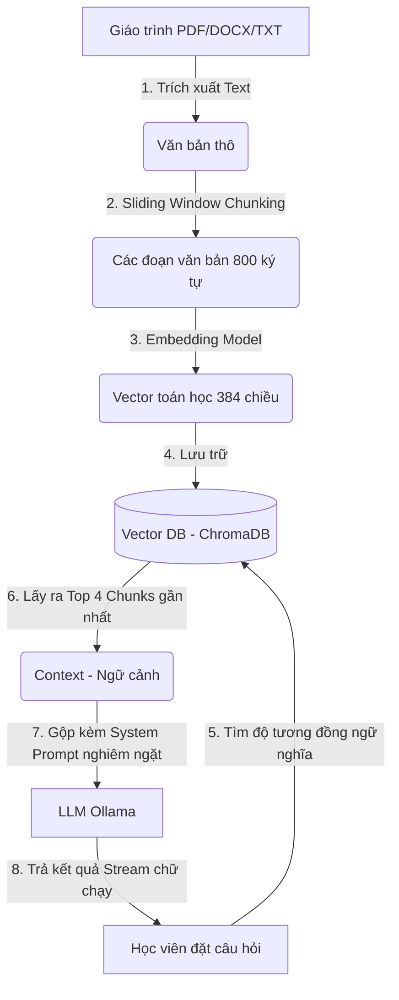
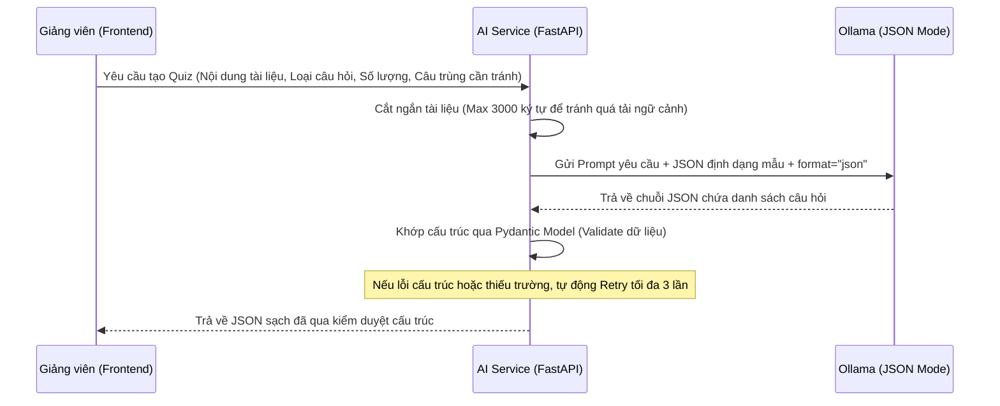
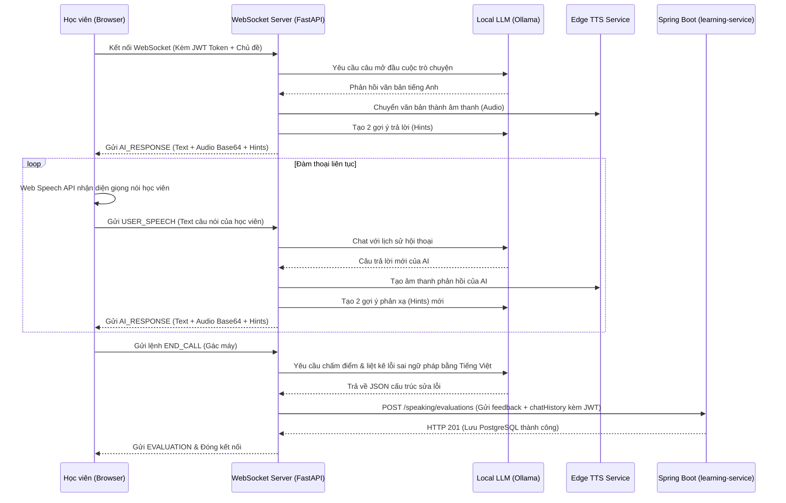

# 🧠 HƯỚNG DẪN GIẢI THÍCH KIẾN TRÚC & LUỒNG HOẠT ĐỘNG PHÂN HỆ AI
> **Dành cho buổi Bảo vệ Đồ án tốt nghiệp / Báo cáo môn học - Hệ thống St3pLearn**

Dự án St3pLearn sử dụng mô hình **Hybrid (Lai)**:
* **Backend chính (Spring Boot - Java):** Quản lý nghiệp vụ, người dùng, khóa học, điểm số, thanh toán và lưu trữ dữ liệu chính trong PostgreSQL.
* **AI Engine (FastAPI - Python):** Chạy độc lập phục vụ các chức năng trí tuệ nhân tạo, giao tiếp với mô hình ngôn ngữ lớn (LLM) chạy cục bộ qua **Ollama** và dịch vụ chuyển đổi văn bản thành giọng nói **Edge TTS**.

---

## 1. RAG Chatbot (Hệ thống hỏi đáp tài liệu khóa học)

### 📌 Khái niệm cốt lõi
**RAG (Retrieval-Augmented Generation - Tạo lập tăng cường bằng truy xuất)** là kỹ thuật cải tiến câu trả lời của mô hình ngôn ngữ lớn (LLM) bằng cách tích hợp thêm thông tin từ một kho tài liệu bên ngoài (tài liệu PDF, DOCX, TXT môn học của giảng viên tải lên) trước khi gửi yêu cầu đến LLM.
* **Vấn đề giải quyết:** Ngăn ngừa **ảo giác (hallucination)** của AI. AI sẽ chỉ trả lời dựa trên tài liệu được cung cấp của khóa học. Nếu câu hỏi của học sinh nằm ngoài giáo trình, AI sẽ từ chối trả lời thay vì tự bịa ra thông tin.

### 🏗️ Sơ đồ luồng hoạt động (Workflow)



### 💻 Chi tiết triển khai trong Code

#### Bước 1: Trích xuất và băm nhỏ tài liệu (`document_service.py`)
* Khi giảng viên upload giáo trình lên hệ thống, Backend sử dụng thư viện `pypdf` và `python-docx` để đọc mảng bytes và trích xuất thành văn bản thô dạng chuỗi (`extract_text_from_bytes`).
* Văn bản thô được cắt nhỏ thành nhiều đoạn bằng thuật toán **Cửa sổ trượt (Sliding Window)** với cấu hình: `chunk_size = 800` ký tự, và khoảng đè `overlap = 100` ký tự. Khoảng đè giúp bảo toàn ngữ nghĩa của các câu nằm giáp ranh giữa các đoạn cắt.

#### Bước 2: Nhúng Vector và Lưu trữ (`vector_store.py`)
* Các đoạn nhỏ (chunks) được đẩy vào **ChromaDB** (cơ sở dữ liệu vector chạy local).
* ChromaDB sử dụng mô hình nhúng mặc định `all-MiniLM-L6-v2` của thư viện `sentence-transformers` để biến đổi các đoạn text thành các vector toán học đa chiều đại diện cho ngữ nghĩa của chúng.

#### Bước 3: Tìm kiếm tương đồng & Tạo câu trả lời (`rag_service.py` & `routes.py`)
* Khi học viên gửi câu hỏi trong khung chat của bài học, hệ thống thực hiện tìm kiếm độ tương đồng Cosine (Cosine Similarity) trong ChromaDB để truy xuất ra `top_k = 4` chunks liên quan nhất thuộc về `course_id` đó.
* Đưa 4 chunks tài liệu này vào vai trò **Ngữ cảnh (Context)**, gộp cùng câu hỏi của người dùng và System Prompt cực kỳ nghiêm ngặt:
  > *"Bạn là một Gia sư học thuật ảo. Tuyệt đối không được sử dụng kiến thức bên ngoài ngữ cảnh được cung cấp. Nếu câu hỏi không có trong ngữ cảnh, bắt buộc phải trả lời: 'Tôi xin lỗi, câu hỏi này nằm ngoài phạm vi tài liệu kiến thức được cung cấp của khóa học.'"*
* Kết nối API của Ollama `/api/chat` được thiết lập với tham số `"stream": true` để truyền tải dữ liệu phản hồi dạng luồng (stream) về Frontend, tạo hiệu ứng gõ chữ thời gian thực giúp giảm cảm giác chờ đợi của học viên.

---

## 2. AI Quiz Generator (Tự động biên soạn câu hỏi kiểm tra)

### 📌 Khái niệm cốt lõi
Tính năng cho phép Giảng viên tạo nhanh bộ đề thi trắc nghiệm (chọn 1 đáp án đúng, chọn nhiều đáp án đúng, đúng/sai, tự luận) từ nội dung bài học bằng cách sử dụng **Ollama JSON Mode** để sinh ra dữ liệu cấu trúc sạch, đảm bảo kiểm duyệt dữ liệu trước khi lưu vào PostgreSQL của Spring Boot.

### 🏗️ Sơ đồ luồng hoạt động (Workflow)



### 💻 Chi tiết triển khai trong Code (`quiz_generator_service.py`)
* **Kiểm soát Token đầu vào:** Hệ thống tự động cắt ngắn văn bản giáo trình đầu vào nếu vượt quá `max_chars = 3000` (`truncate_text`) để tránh gây quá tải bộ nhớ ngữ cảnh và làm giảm chất lượng phản hồi của LLM cục bộ.
* **Chống trùng lặp:** Nhận danh sách các câu hỏi hiện có (`existing_questions`) và hướng dẫn LLM tránh tạo ra câu hỏi có ý nghĩa tương tự thông qua Prompt.
* **JSON Mode khắt khe:** Gọi Ollama API `/api/generate` với cấu hình `"format": "json"`. Điều này bắt buộc mô hình LLM chỉ trả về một chuỗi JSON thuần túy, không có văn bản dẫn giải thừa.
* **Bảo hiểm cấu trúc (Validation & Retry):** Sử dụng thư viện **Pydantic** (`GenerateQuizResponse.model_validate(json_data)`) để kiểm tra xem JSON trả về có đúng các trường yêu cầu hay không (`question_text`, `options`, `is_correct`, `explanation`). Nếu mô hình trả về lỗi cấu trúc hoặc thiếu trường do quá trình sinh ngẫu nhiên, hệ thống sẽ tự động bắt lỗi và thực hiện thử lại tối đa 3 lần (`attempt in range(3)`) trước khi báo lỗi về client.

---

## 3. AI Speaking Room (Phòng luyện nói phản xạ & Nhận xét sửa lỗi)

### 📌 Khái niệm cốt lõi
Phòng đàm thoại tiếng Anh 1-1 thời gian thực. Sử dụng **Web Speech API** (Client) để nhận diện giọng nói thành văn bản, **FastAPI WebSocket** để giữ kết nối đàm thoại liên tục độ trễ thấp, **Edge TTS** để sinh giọng đọc AI tự nhiên và **LLM** để chấm điểm, phân tích sửa lỗi ngữ pháp kèm giải thích tiếng Việt chi tiết cuối buổi học.

### 🏗️ Sơ đồ luồng hoạt động (Workflow)



### 💻 Chi tiết triển khai trong Code (`speaking_websocket.py` & Frontend)

#### Bước 1: Kết nối thời gian thực qua WebSocket (`@router.websocket("/ws")`):
* Học viên có thể tự nhập chủ đề đàm thoại hoặc chọn chủ đề mẫu. Chủ đề này được mã hóa và truyền qua tham số kết nối `topicContent` để gộp vào `System Prompt` định hướng cuộc trò chuyện của LLM.
* Kết nối WebSocket được giữ liên tục để đảm bảo tốc độ phản hồi cực kỳ nhanh (dưới 1.5 giây), không bị trễ như kết nối HTTP truyền thống.

#### Bước 2: Nhận diện giọng nói & Chuyển văn bản sang âm thanh (`edge_tts_service.py`):
* **Nhận diện giọng nói phía Client (STT):** Sử dụng công nghệ nhận diện giọng nói trình duyệt **Web Speech API** (`webkitSpeechRecognition`), chuyển câu nói của học viên thành text và gửi qua WebSocket.
* **Sinh giọng nói của AI (TTS):** Ở Backend FastAPI, sử dụng thư viện `edge-tts` của Microsoft Edge để chuyển câu phản hồi dạng text của AI sang định dạng âm thanh `.mp3` chất lượng cao, mã hóa thành chuỗi **Base64** gửi về trình duyệt. Frontend chỉ cần giải mã và phát trực tiếp qua đối tượng `Audio` của HTML5.

#### Bước 3: Bộ lọc tạo gợi ý đối đáp (Hints):
* Song song với câu trả lời của AI, FastAPI sẽ gọi một hàm phụ (`call_ollama_generate_hint`) gửi câu nói đó qua LLM để sinh nhanh 2 mẫu câu phản hồi ngắn dưới 10 từ (Option 1: Đồng tình, Option 2: Hỏi lại hoặc mở rộng vấn đề) giúp học viên vượt qua các tình huống bị "bí từ".

#### Bước 4: Khắc phục lỗi bất đồng bộ STT trên Frontend (`page.tsx`):
* Trong React, các hàm callback sự kiện (`onend`, `onresult`) của Web Speech API lưu trữ trạng thái đóng (closure). Để tránh việc micro khởi động đè gây trùng lặp âm thanh hoặc tự động gửi voice liên tục khi AI đang nói, hệ thống sử dụng các biến tham chiếu đồng bộ: `chatStateRef` và `isMutedRef` (`useRef` trong React) để kiểm soát chính xác trạng thái micro theo thời gian thực.

#### Bước 5: Đánh giá cuối buổi học và Đồng bộ cơ sở dữ liệu:
* Khi nhận lệnh `END_CALL`, hệ thống gom toàn bộ lịch sử trò chuyện `conversation_history` và gửi yêu cầu chấm điểm đến LLM với prompt yêu cầu trả về định dạng JSON cụ thể:
  ```json
  {
    "feedback": "Nhận xét chung bằng tiếng Việt...",
    "corrections": [
      {
        "original": "câu học viên nói sai",
        "corrected": "câu sửa lại cho đúng",
        "explanation": "giải thích lỗi sai ngữ pháp bằng tiếng Việt"
      }
    ]
  }
  ```
* Sau khi nhận JSON đánh giá, FastAPI đính kèm mảng lưu toàn bộ lịch sử hội thoại (`chatHistory`) vào và thực hiện một request HTTP POST đồng bộ sang API Gateway của Spring Boot để cập nhật cột `feedback` (kiểu dữ liệu TEXT/JSON trong PostgreSQL) thông qua thực thể `SpeakingEvaluation`. JWT Token được FastAPI chuyển tiếp trong Header `Authorization` giúp đảm bảo tính bảo mật và định danh đúng học viên.

---

### 💡 Lời khuyên vàng khi trả lời Hội đồng chấm Đồ án:
1. **Tại sao không sử dụng OpenAI/GPT-4?**
   * *Trả lời:* Sử dụng mô hình chạy cục bộ (Ollama - Llama 3) giúp hệ thống hoạt động hoàn toàn miễn phí, không phụ thuộc vào Internet ngoại vi và bảo mật dữ liệu tuyệt đối cho học viên.
2. **Hệ thống có chịu tải tốt không?**
   * *Trả lời:* Nhờ kiến trúc Microservices tách biệt và chạy dịch vụ AI trên FastAPI (sử dụng cơ chế không đồng bộ - Asynchronous I/O của Python), các tác vụ nặng về AI không gây ảnh hưởng đến hiệu năng hoạt động của hệ thống Spring Boot.
3. **Cách thức lưu lịch sử đàm thoại hoạt động thế nào?**
   * *Trả lời:* Lịch sử đàm thoại được đồng bộ trực tiếp dưới dạng cấu trúc JSON nén trong cột `feedback` của PostgreSQL. Việc này giúp hệ thống truy xuất và kết xuất dữ liệu lịch sử cực kỳ linh hoạt mà không cần phải thực hiện quá nhiều truy vấn SQL phức tạp.
